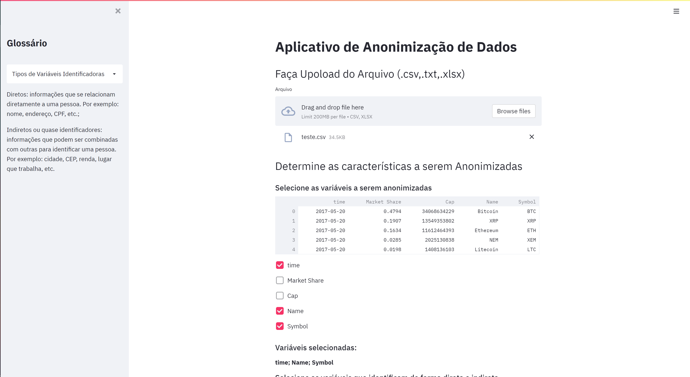
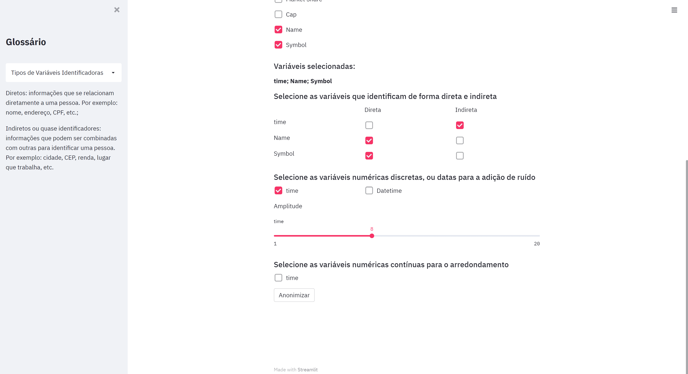

# anonimizacao_dados

## Contexto

O código desenvolvido tem por objetivo a anonimização de dados sensíveis. As variáveis que podem identificar um indivíduo de forma direta, por exemplo, o nome, endereço, CPF, são criptografadas de forma irreversível. As variáveis que podem identificar os indivíduos de forma indireta podem ser perturbadas adicionando um ruído, ou serem arredondadas.


Há 3 métodos, além do construtor. São eles ``remove_personal_info()``, ``add_noise()``, ``round_data()``.

Foi utilizada a biblioteca [CapePrivacy](https://github.com/capeprivacy/cape-python) para realizar a criptografia e adicionar o ruído.

além disso, as bibliotecas pandas e numpy foram utilizadas.


## Guia rápido:
 
 ```
from anonimizacao.py import * 

dados_anonimizados=Anonymization(df=dataframe)

supoonhamos que hajam 5 colunas, ['nome','altura','data_nascimento','data_obito','idade']

dados_anonimizados.remove_personal_info(cols=['nome'])

dados_anonimizados.add_noise(cols=['data_nascimento','data_obtido','idade'],amplitudes=[5,5,2])

dados_anonimizados.round_data(cols=['altura'])


novo_dataframe=dados_anonimizados.df

```

## Mais informações

O código tem apenas um atributo, ``df`` que é o dataframe que está sendo tratado. 

O parâmetro ``cols`` e ``amplitudes`` que aparecem no métodos devem ser passados em forma de lista, vetor, ou algum objeto iterável.

O método ```add_noise()`` funciona tanto com número, quanto com datas. O parâmetro amplitudes significa a amplitude máxima do rúido que está sendo adicionado. 

O método de ```remove_pesonal_info()``` está implementado de forma que a criptografia de uma variável contendo a mesma informação será sempre diferente. Isso é feito por meio de uma variável chamada random. **Caso haja interesse em um padrão criptográfico, ou seja, que a criptografia de uma mesma variável seja sempre a mesma é necessário redefinir essa variável por alguma chave.**
Por exemplo:

```
...
        for column in cols:
            self.df[column]=self.df[column].astype(str)
            random='my_secret_key'#np.random.randint(0,9,size=50)

...

```

# Informações sobre o App

Um aplicativo foi criado para que fosse possível realizar a anonimização sem a necessidade de rodar o código no terminal, visando possibilitar que toda a equipe utilizasse o código de anonimização caso fosse necessário. 

O app foi criado utilizando a biblioteca Streamlit. No app é possível selecionar quais variáveis deve ser anonimizadas e de que forma, ao fim do processo o código é rodado o dataframe anonimizado é passível de download.
 
É necessário que seja feito o deploy desse app, para rodá-lo em sua máquina basta executar o código:


```
streamlit run anonnimizacao_app.py
```

Eis uma foto do app executado.




